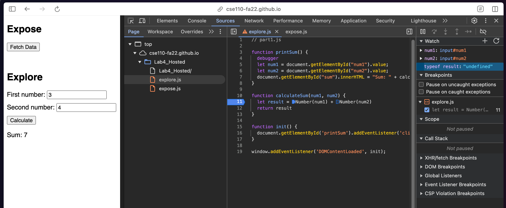

# DevTools Part 2

1. Instead of adding the two numbers, script concatenates them as strings.
2. I would add some type checking code to make sure that inputs are both integers and then add them. This way the result will be as expected.
